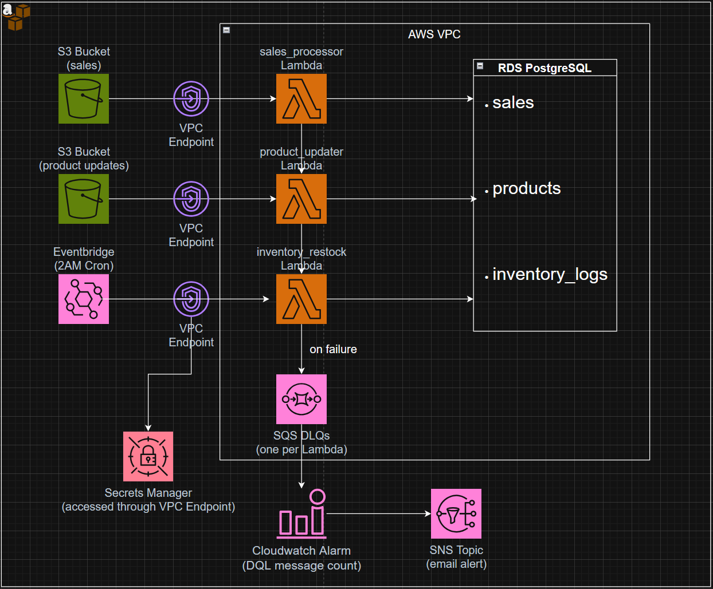

# AWS Uniqlo Inventory System Project
This project was designed to implement tools I hadn't used in previous projects, and to integrate them into a mock inventory management system for a clothing store such Uniqlo. 

The AWS infrastructure here was created with Terraform (IaC), meaning it can be deployed to an AWS account programmatically, enabling easy infrastructure management and iteration. CI/CD is also integrated via GitHub with included tests, so any Git Push command to the repo triggers automatic tests and infrastructure deployment. 

This inventory system is structured in the following way:
- Sales
    - S3 bucket for storing .json sales data, Lambda sales function updates the RDS sales table
- Products
    - S3 bucket for storing .json product updates (new price or item), Lambda function updates RDS products table
- Inventory Updates
    - Daily scheduled Lambda function to check low stock, and to set stock back to 100 and log it if stock count falls below certain threshold

# Architecture


# Tech Stack
Cloud Infrastructure
- AWS Lambda — serverless compute for the 3 ETL functions
- AWS RDS PostgreSQL — relational database for products, sales, inventory_logs
- AWS S3 — event source for sales and product update pipelines
- AWS Secrets Manager — stores RDS credentials securely
- AWS SQS — dead letter queues for failed Lambda invocations
- AWS SNS — email alerts when DLQ receives messages
- AWS CloudWatch — metric alarms that trigger SNS on DLQ activity
- AWS EventBridge — cron schedule for daily inventory restock
- AWS VPC — private networking, subnets, security groups, VPC endpoints

Infrastructure as Code
- Terraform — all AWS resources defined and deployed as code, modular structure

Application
- Python 3.9 — Lambda function runtime
- pg8000 — pure Python PostgreSQL driver (no compiled binaries, Lambda compatible)
- boto3 — AWS SDK for Python (S3, Secrets Manager)

CI/CD
- GitHub Actions — automated test and deploy pipeline on push
- S3 + DynamoDB — remote Terraform state storage and state locking

Testing
- pytest — unit test framework
- unittest.mock — mocking boto3 and pg8000 for isolated tests


# Project Structure
```text
aws-uniqlo-inventory-system/
├── .github/
│   └── workflows/
│       └── deploy.yml              # GitHub Actions CI/CD pipeline
│
├── database/
│   └── schema.sql                  # PostgreSQL table definitions
│
├── lambda/
│   ├── sales_processor/
│   │   ├── lambda_function.py      # Validates and inserts sales into RDS
│   │   ├── requirements.txt
│   │   └── pg8000/                 # Bundled dependencies (pure Python PostgreSQL driver)
│   ├── product_updater/
│   │   ├── lambda_function.py      # Updates product price and/or stock in RDS
│   │   ├── requirements.txt
│   │   └── pg8000/
│   └── inventory_restock/
│       ├── lambda_function.py      # Restocks products below threshold, logs to RDS
│       ├── requirements.txt
│       └── pg8000/
│
├── sample_data/
│   ├── test_sale.json              # Sample S3 payload for sales_processor
│   ├── test_product_update.json    # Sample S3 payload for product_updater
│   ├── test_inventory_restock.json # Sample payload for inventory_restock
│   └── test_invalid_sale.json      # Sample invalid payload for DLQ testing
│
├── terraform/
│   ├── main.tf                     # Root module, calls all child modules
│   ├── variables.tf                # Input variables (region, project name, email)
│   ├── outputs.tf                  # Outputs (RDS endpoint, bucket names)
│   ├── providers.tf                # AWS provider + S3 remote backend config
│   ├── terraform.tfvars.example    # Example tfvars (copy to terraform.tfvars)
│   └── modules/
│       ├── networking/             # VPC, subnets, security groups, VPC endpoints
│       ├── storage/                # S3 buckets, RDS PostgreSQL, Secrets Manager
│       ├── compute/                # Lambda functions, IAM roles, S3 event triggers
│       ├── messaging/              # SQS DLQs, SNS topic, CloudWatch alarms
│       └── scheduling/             # EventBridge rule for daily inventory restock
│
├── tests/
│   ├── test_sales_processor.py
│   ├── test_product_updater.py
│   └── test_inventory_restock.py
│
├── .gitignore
└── README.md
```

# Setup instructions
- Copy the repo to a local destination
- Install prerequisites (AWS CLI, Terraform, Python 3.9+)
    - AWS CLI:
        - Navigate to repo's root directory and run the following commands in Git Bash:
            - pip install awscli
            - aws configure
    - Terraform:
        - Download directly from developer.hashicorp.com/terraform/downloads
        - Once installed, verify the installation by running the following command in Git Bash:
            - terraform -version
- Login to your AWS account and navigate to the AWS CLI and run these commands:
    - aws s3api create-bucket --bucket <UNIQUE_BUCKET_NAME> --region us-east-1
        - Creates a bucket to store our Terraform state files
    - aws s3api put-bucket-versioning --bucket <UNIQUE_BUCKET_NAME> --versioning-configuration Status=Enabled
        - Enables versioning for said bucket
    - aws dynamodb create-table \
            --table-name <UNIQUE_TABLE_NAME_FOR_TERRAFORM_LOCKS> \
            --attribute-definitions AttributeName=LockID,AttributeType=S \
            --key-schema AttributeName=LockID,KeyType=HASH \
            --billing-mode PAY_PER_REQUEST \
            --region us-east-1
        - Creates a DynamoDB table to enable locking (preventing two users from making a modification to the Terraform state at the same time)
- Update /terraform/providers.tf with the <UNIQUE_BUCKET_NAME> and <UNIQUE_TABLE_NAME_FOR_TERRAFORM_LOCKS> created above for the Terraform S3 state files and DynamoDB Terraform state locking within the "backend "s3" {}" section
- Create /terraform/terraform.tfvars and copy the code from terraform.tfvars.example
    - Modify where it says:
        - alert_email = "<YOUR_EMAIL>"
    - Terraform uses this to register your email to the DLQ SNS topics (see terraform.tfvars.example as an example)
- To run Terraform and deploy the infrastructure, run the following commands in Git Bash:
    - terraform init (initializes terraform)
    - terraform plan (informs user on what the deployment plan will be)
    - terraform apply (initiates actual deployment onto AWS resources)
- Check your email address for a confirmation of the registration to the DLQ SNS topic and confirm
- To configure the GitHub Actions credentials (allowing automatic CI/CD), login to your GitHub account online, and within the repo's settings, navigate to "Secrets and variables", and add the following:
    - AWS_ACCESS_KEY_ID
        - Access key id from the IAM role you will be using
    - AWS_SECRET_ACCESS_KEY
        - Secret access key from the IAM role you will be using
    - TF_VAR_ALERT_EMAIL
        - The email address where you would like to receive alerts from regarding Terraform deployment status

# How to test it

## sales_processor lambda function
Upload the sample sales file to the sales S3 bucket via the AWS CLI:
- aws s3 cp sample_data/test_sale.json s3://<YOUR_SALES_BUCKET_NAME>/test_sale.json

This triggers the sales_processor Lambda which validates the sale, inserts it into the sales table, and deducts stock from the products table. Check the Lambda logs in CloudWatch to verify.

To test the DLQ, upload the invalid sample file:
- aws s3 cp sample_data/test_invalid_sale.json s3://<YOUR_SALES_BUCKET_NAME>/test_invalid_sale.json

After ~5 minutes, a CloudWatch alarm will fire and you'll receive an email alert from SNS.

## product_updater lambda function
Upload the sample product update file to the product updates S3 bucket:
- aws s3 cp sample_data/test_product_update.json s3://<YOUR_PRODUCT_UPDATES_BUCKET_NAME>/test_product_update.json

This triggers the product_updater Lambda which updates the product's price and/or stock in the products table. Check the Lambda logs in CloudWatch to verify.

## inventory_restock lambda function
Trigger the Lambda manually via the AWS console:
- Navigate to Lambda → uniqlo-sales-etl-dev-inventory-restock → Test
- Create a test event with an empty JSON body: {}
- Run it and check the CloudWatch logs

If all products are above the stock threshold of 50, it will log "All stock above threshold". To see the restock logic trigger, manually set a product's stock below 50 in RDS first.

## Running tests locally
- pip install pytest pg8000 boto3
- pytest tests/ -v

## Verifying data in RDS
To verify data was written correctly, connect to RDS via an EC2 instance:

1. Start the EC2 instance in the AWS console (EC2 → Instances → start)
2. SSH into the bastion:
    - ssh -i <YOUR_KEY.pem> ec2-user@<BASTION_PUBLIC_IP>
3. Connect to RDS:
    - psql -h <YOUR_RDS_ENDPOINT> -U postgres -d uniqlo_sales

Then run the relevant query depending on which Lambda you tested:

sales_processor:
- SELECT * FROM sales ORDER BY sold_at DESC LIMIT 5;
- SELECT sku, stock_quantity FROM products WHERE sku = 'UNQ-001';

product_updater:
- SELECT sku, price, stock_quantity FROM products WHERE sku = 'UNQ-001';

inventory_restock:
- SELECT * FROM inventory_logs ORDER BY restocked_at DESC LIMIT 5;
- SELECT sku, stock_quantity FROM products;

# Teardown
To destroy all project infrastructure, run the following command in Git Bash from the terraform/ directory:
- terraform destroy

This tears down everything Terraform manages — RDS, Lambdas, VPC, S3 buckets, SQS, SNS, EventBridge, etc.

Then manually delete the Terraform state backend resources via the AWS CLI:
- aws s3 rm s3://<YOUR_BUCKET_NAME> --recursive
- aws s3api delete-bucket --bucket <YOUR_BUCKET_NAME> --region us-east-1
- aws dynamodb delete-table --table-name <YOUR_TABLE_NAME> --region us-east-1

Notes: 
- The S3 bucket must be emptied before it can be deleted, which is what the first command does.
- Secrets Manager secret — has a minimum 7-day recovery window before full deletion, this is AWS default behavior
